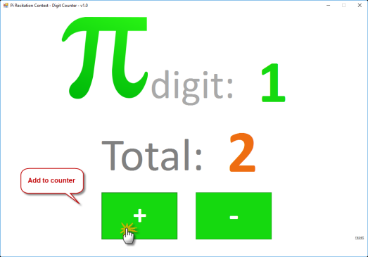
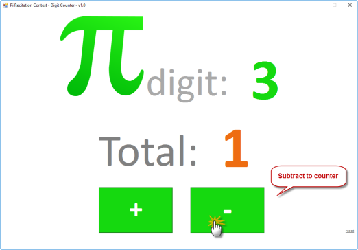
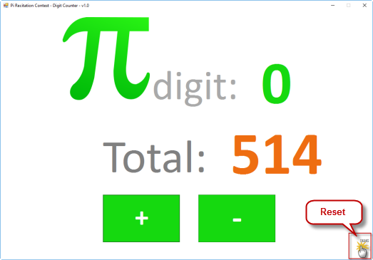

# PiCounter
Pi digit counter for Pi Recitation Contests. Users will be able to follow the recited Pi digits and also see the current score

# Introduction
The date March/14 or 3/14 is globally known by all as "Pi Day". In this day, many schools plan "Pi Recitation Contests" for students to compete, but unfortunately judges don't have a practical way of following along the recited digits while scoring the recitation, which tends to be extremely fast-paced. 

With this simple PiCounter the judges will be able to follow the recited Pi digits and also see the current score. PiCounter is meant to be used with a projector in order to display the score and the recited digit to the contest crowd. Students can also use PiCounter individually to practice for the contest and become the ultimate champion of Pi.

# Setup
To install, simply download the [installer](./Releases/v1.0/PiCounter_Setup.msi) and follow the setup wizard: 

PiCounter/Releases/v1.0/PiCounter_Setup.msi

# Getting Started
1. Add to counter by clicking the "+" button. Other valid keyboard keys are: "Right", "+"

    

2. Subtract to counter by clicking the "+" button. Other valid keyboard keys are: "Left", "-"

    

3. Reset counter by clicking the "reset" button.

    

That's it! Enjoy!!!
